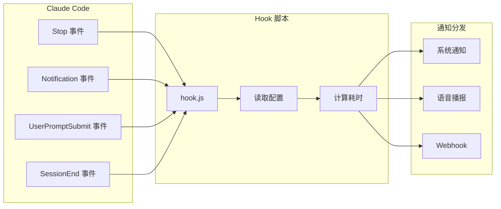

# Claude Code Notifier

为 [Claude Code](https://docs.anthropic.com/en/docs/claude-code) 提供任务完成通知的轻量级扩展工具，支持跨平台桌面通知与多平台 Webhook 推送，让你在专注其他工作时也不会错过 Claude 的长任务结果。

---

## ✨ 特性

- ✅ **跨平台桌面通知**：支持 macOS / Windows / Linux
- 🔔 **多渠道提醒**：系统通知、语音播报、Webhook（钉钉 / 飞书 / 企业微信 / Slack / Discord / Telegram / 自定义）
- ⏱️ **任务耗时统计**：自动记录每次任务运行时长
- 🧠 **按需提醒**：支持设置最小耗时阈值，只在“长任务完成”时提醒，避免被频繁打扰
- 🧹 **会话管理与清理**：记录会话状态，自动清理过期数据
- 🛠️ **CLI 工具**：一条命令检查 / 测试 / 安装 Hooks，便于排查问题

---

## 🧩 使用场景

- 让 Claude 帮你执行耗时分析或大项目生成代码时，你可以切出去处理其它事情，任务完成后自动收到通知  
- 在 Claude 请求执行潜在危险操作（如删除文件、批量修改等）时，通过 Notification 事件进行“权限确认”提醒  
- 当 Claude 长时间等待输入或处于空闲状态时，通过通知提醒你继续对话

---

## 🚀 快速开始

> 适用于：**已安装 Claude Code 桌面版** 的用户。  
> 默认使用预编译发布包，无需本地构建。

### macOS / Linux

```bash
# 1. 下载并解压到 ~/.claude 目录
mkdir -p ~/.claude && cd ~/.claude
curl -L https://github.com/Flobby949/cc-notifier/releases/latest/download/cc-notifier-dist.tar.gz | tar -xz

# 2. 执行安装脚本（自动配置 hooks 等）
cd cc-notifier && ./setup.sh

# 3. 验证安装是否成功
ccntf check    # 检查 hooks 配置
ccntf test     # 发送测试通知
```

### Windows

> 推荐在 **Git Bash** 或支持 `sh` 的终端中执行安装脚本。

```bash
# 在 Git Bash 中执行
mkdir -p "$USERPROFILE/.claude" && cd "$USERPROFILE/.claude"
curl -L https://github.com/Flobby949/cc-notifier/releases/latest/download/cc-notifier-dist.tar.gz | tar -xz

cd cc-notifier && ./setup.sh

# 验证安装
ccntf check
ccntf test
```

> 安装完成后，**重启 Claude Code** 以加载新的 Hooks 配置。

---

## ⚙️ 工作原理与架构

Claude Code Notifier 基于 Claude Code 的 [Hooks 机制](https://docs.anthropic.com/en/docs/claude-code/hooks)，在特定事件发生时触发通知，并根据配置进行分发和过滤。

### 支持的 Hook 事件

| 事件                | 触发时机                         | 用途                     |
|---------------------|----------------------------------|--------------------------|
| `Stop`              | Claude 完成任务                  | 发送任务完成通知         |
| `Notification`      | 权限请求、空闲提示等             | 发送即时提醒             |
| `UserPromptSubmit`  | 用户发送消息                     | 记录任务开始时间         |
| `SessionEnd`        | 会话结束                         | 清理会话数据 / 统计信息  |

### 架构示意



### 项目结构概览

```text
cc-notifier/
├── src/
│   ├── cli.ts                 # CLI 命令入口
│   ├── hook.ts                # Hook 事件处理（主入口）
│   ├── config.ts              # 配置文件读取
│   ├── session.ts             # 会话状态管理
│   ├── logger.ts              # 日志记录
│   ├── types.ts               # TypeScript 类型定义
│   ├── notification/          # 通知模块
│   │   ├── index.ts           # 通知分发
│   │   ├── system.ts          # 系统桌面通知
│   │   ├── voice.ts           # 语音播报
│   │   └── terminal.ts        # 终端检测与激活
│   └── webhook/               # Webhook 模块
│       ├── index.ts           # Webhook 分发
│       ├── http.ts            # HTTP 请求封装
│       └── providers/         # 各平台实现
│           ├── dingtalk.ts    # 钉钉
│           ├── feishu.ts      # 飞书
│           ├── wecom.ts       # 企业微信
│           ├── slack.ts       # Slack
│           ├── discord.ts     # Discord
│           ├── telegram.ts    # Telegram
│           └── custom.ts      # 自定义 Webhook
├── dist/                      # 编译输出
├── setup.sh                   # macOS/Linux 安装脚本
├── setup.bat                  # Windows 安装脚本（可选）
└── package.json
```

---

## 🔧 Claude Code Hooks 配置（手动方式）

> 一般情况下，你**不需要手动配置**，安装脚本会自动生成 `settings.json`。本节用于了解原理或手动调试。

Claude Code 的配置文件路径为：`~/.claude/settings.json`。

### macOS / Linux 示例

```json
{
  "hooks": {
    "Stop": [
      {
        "hooks": [
          {
            "type": "command",
            "command": "~/.claude/cc-notifier/dist/hook.js"
          }
        ]
      }
    ],
    "Notification": [
      {
        "hooks": [
          {
            "type": "command",
            "command": "~/.claude/cc-notifier/dist/hook.js"
          }
        ]
      }
    ],
    "UserPromptSubmit": [
      {
        "hooks": [
          {
            "type": "command",
            "command": "~/.claude/cc-notifier/dist/hook.js"
          }
        ]
      }
    ],
    "SessionEnd": [
      {
        "hooks": [
          {
            "type": "command",
            "command": "~/.claude/cc-notifier/dist/hook.js"
          }
        ]
      }
    ]
  }
}
```

### Windows 示例（使用 node 执行）

```json
{
  "hooks": {
    "Stop": [
      {
        "hooks": [
          {
            "type": "command",
            "command": "node \"C:\\Users\\你的用户名\\.claude\\cc-notifier\\dist\\hook.js\""
          }
        ]
      }
    ],
    "Notification": [
      {
        "hooks": [
          {
            "type": "command",
            "command": "node \"C:\\Users\\你的用户名\\.claude\\cc-notifier\\dist\\hook.js\""
          }
        ]
      }
    ],
    "UserPromptSubmit": [
      {
        "hooks": [
          {
            "type": "command",
            "command": "node \"C:\\Users\\你的用户名\\.claude\\cc-notifier\\dist\\hook.js\""
          }
        ]
      }
    ],
    "SessionEnd": [
      {
        "hooks": [
          {
            "type": "command",
            "command": "node \"C:\\Users\\你的用户名\\.claude\\cc-notifier\\dist\\hook.js\""
          }
        ]
      }
    ]
  }
}
```

> 请将 `"你的用户名"` 替换为实际 Windows 用户名。  
> 如果只关心“任务完成”提醒，可以只配置 `Stop` 和 `UserPromptSubmit` 两个事件。

---

## 📝 配置说明

### 配置文件位置

默认配置文件路径：`~/.claude/webhook-config.json`  
可以通过运行以下命令进行初始化：

```bash
ccntf init
```

### 通知相关配置

| 参数                      | 类型    | 默认值 | 说明                                         |
|---------------------------|---------|--------|----------------------------------------------|
| `minDuration`             | number  | 10     | 最小通知时长（秒），任务耗时低于此值不通知   |
| `enableSystemNotification`| boolean | true   | 是否启用桌面通知                             |
| `enableVoice`            | boolean | false  | 是否启用语音播报                             |
| `autoActivateWindow`     | boolean | false  | 任务完成后是否自动激活终端窗口               |

### 日志与会话配置

| 参数                   | 类型    | 默认值 | 说明                                  |
|------------------------|---------|--------|---------------------------------------|
| `enableLogging`        | boolean | true   | 是否记录日志                          |
| `enableSessionCleanup` | boolean | true   | 是否自动清理过期会话文件              |
| `sessionCleanupDays`   | number  | 7      | 会话文件保留天数                      |

### Notification Hook 配置

| 参数                     | 类型      | 默认值 | 说明                      |
|--------------------------|-----------|--------|---------------------------|
| `enableNotificationHook` | boolean   | true   | 是否启用 Notification 通知|
| `notificationHookTypes`  | string[]  | 见下   | 需要通知的通知类型        |

可选的 `notificationHookTypes` 值：

| 类型                  | 说明               |
|-----------------------|--------------------|
| `permission_prompt`   | 权限请求提示       |
| `idle_prompt`         | 空闲提示           |
| `auth_success`        | 认证成功           |
| `elicitation_dialog`  | 信息收集对话框     |

### Webhook 配置

支持多种平台的 Webhook 推送（钉钉 / 飞书 / 企业微信 / Slack / Discord / Telegram / 自定义）。  
详细配置请参考：[`docs/WEBHOOK.md`](docs/WEBHOOK.md)。

---

## 🧪 CLI 命令一览

安装完成后，将提供 `ccntf` 命令：

| 命令                       | 说明                         |
|----------------------------|------------------------------|
| `ccntf test`               | 测试所有通知                 |
| `ccntf test stop`          | 测试 Stop 事件               |
| `ccntf test notification`  | 测试 Notification 事件       |
| `ccntf config`             | 查看当前配置                 |
| `ccntf init`               | 初始化配置文件               |
| `ccntf hooks show`         | 查看 Hooks 配置              |
| `ccntf hooks install`      | 安装 / 更新 Hooks            |
| `ccntf hooks update`       | 更新 Hooks 路径到当前位置    |
| `ccntf check`              | 检查 Hooks 是否正确          |
| `ccntf backup [path]`      | 备份 Claude settings.json    |
| `ccntf clean`              | 清理日志和会话文件           |
| `ccntf help`               | 查看帮助                     |

---

## 💻 平台支持

### 桌面通知

| 平台   | 实现方式                       | 点击激活终端 |
|--------|--------------------------------|--------------|
| macOS  | `terminal-notifier` / node-notifier | 支持   |
| Windows| node-notifier                  | 支持         |
| Linux  | node-notifier（基于 libnotify）| 不支持       |

macOS 推荐安装 `terminal-notifier`：

```bash
brew install terminal-notifier
```

Linux 需要安装 `libnotify`：

```bash
# Debian / Ubuntu
sudo apt install libnotify-bin

# Fedora
sudo dnf install libnotify

# Arch
sudo pacman -S libnotify
```

### 语音播报

| 平台   | 支持情况        |
|--------|-----------------|
| macOS  | ✓ (`say` 命令)  |
| Windows| ✓ (PowerShell)  |
| Linux  | ✗               |

---

## 🩺 故障排查

### 看不到任何通知？

1. 先运行：

   ```bash
   ccntf check
   ccntf test
   ```

2. 检查系统通知权限：
   - macOS：系统设置 → 通知 → 终端 / 相关 App 是否允许通知
   - Windows / Linux：检查系统通知中心 / 桌面环境设置

3. 若使用 Webhook：
   - 确认目标平台机器人 / Webhook URL 配置正确
   - 检查公司网络是否允许访问对应服务

### 查看日志

```bash
tail -f ~/.claude/webhook-notification.log
```

---

## 🤝 参与贡献

欢迎 Issue / PR / 功能建议：

1. Fork 本仓库
2. 创建特性分支：`git checkout -b feature/my-feature`
3. 提交修改并发起 Pull Request

---

## 📚 参考

- [Claude Code Hooks 官方文档](https://docs.anthropic.com/en/docs/claude-code/hooks)

---

## 📄 License

MIT
